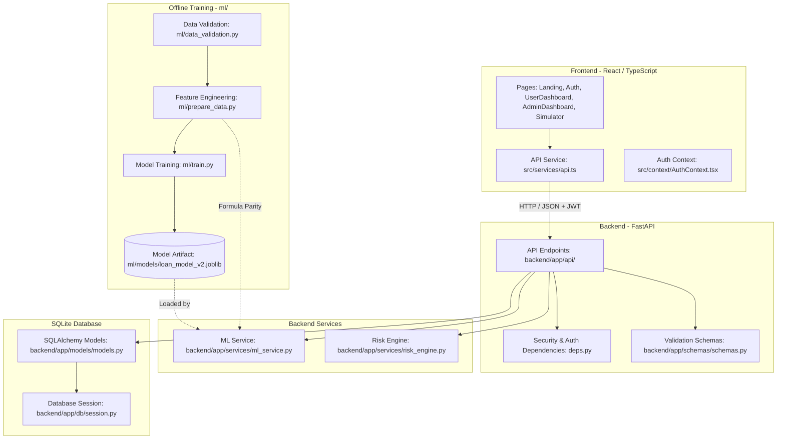
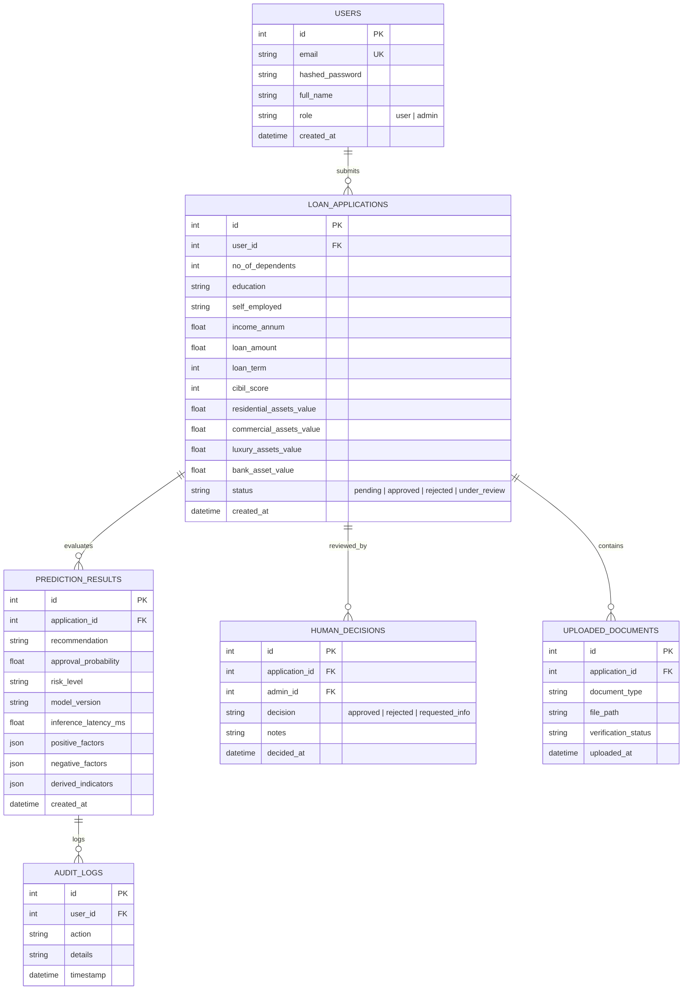
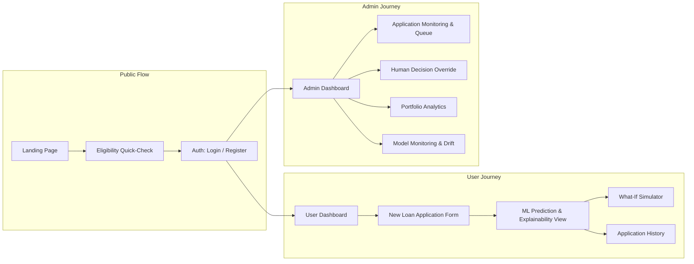

# CrediWiseAI — System Architecture & Contracts

> **Status:** Architecture Lock (Phase 0)  
> **Version:** 2.0.0  
> **Target Currency:** INR (₹)  
> **Model Target:** `loan-model-v2.0` (Gradient Boosting Classifier)

---

## 1. Executive Summary & Vision

**CrediWiseAI** is an AI-powered smart loan decision platform that evaluates applicant financial data, predicts loan approval probabilities, categorizes risk, explains key contributing factors, provides what-if simulation, and supports authorized human review and oversight.

The system is engineered around two non-negotiable core foundations:
1. **Source of Prediction Truth:** The Kaggle INR-native loan approval dataset and its derived `loan-model-v2.0` pipeline.
2. **Deterministic Monetary Context:** 100% native Indian Rupee (INR / ₹) values without arbitrary currency conversions or unit confusion.

---

## 2. Core Architectural Principles

- **Simplicity & Hackathon-Friendly:** Minimal ceremony, explicit data flows, and no premature microservices, message queues, or distributed complexity.
- **Single Responsibility per Layer:** Each module, service, and component has one clear, well-bounded purpose.
- **No Duplicate Logic:** Feature engineering, prediction formulas, and risk heuristics live exclusively in designated backend services.
- **Explainability & Trust:** Every automated decision provides model versioning, probability scores, risk classification, and transparent positive/negative factor attribution.
- **Human-in-the-Loop Governance:** Role-Based Access Control (RBAC) ensures administrators can review, monitor, and override automated decisions with audit logging.
- **Presentation Readiness:** Clear and cohesive structure that a student developer can present and justify before a technical evaluation panel.

---

## 3. Technology Stack

| Layer | Technologies | Role & Purpose |
| :--- | :--- | :--- |
| **Frontend** | React, TypeScript, Tailwind CSS, React Router | Single Page Application providing public, applicant, and admin portals |
| **Backend** | Python 3.10+, FastAPI, SQLAlchemy, Pydantic | High-performance asynchronous REST API, request validation, and orchestrator |
| **Database** | SQLite (via SQLAlchemy ORM) | Lightweight, reliable persistence for users, applications, predictions, and audit logs |
| **Machine Learning** | scikit-learn, pandas, numpy, joblib | Offline training pipeline (`ml/`) and real-time backend inference (`backend/app/services/`) |
| **Authentication** | JWT (OAuth2 Password Bearer), bcrypt hashing | Stateless session management with strict role-based access control (User vs. Admin) |

---

## 4. Layer Separation & Responsibilities

### 4.1 Backend Architecture (`backend/app/`)
- **`api/`**: FastAPI route controllers. Handles HTTP requests, parameter validation via Pydantic, dependency injection (authentication/authorization), and status code responses. No raw database queries or direct ML calculations.
- **`core/`**: Central application settings (`config.py`), security tokens, JWT verification, and CORS configuration.
- **`db/`**: Database engine setup, declarative Base, and session lifecycle management (`session.py`).
- **`models/`**: SQLAlchemy declarative ORM entities (`models.py`) representing database tables and relationships.
- **`schemas/`**: Pydantic models (`schemas.py`) defining input validation contracts, response schemas, and serialization formats.
- **`services/`**:
  - `ml_service.py`: Exclusively responsible for loading `loan_model_v2.joblib`, computing deterministic engineered features, generating inference probabilities, and extracting factor contributions.
  - `risk_engine.py`: Computes composite risk levels, financial stress indicators, debt ratios, and decision recommendations.
- **`tests/`**: Automated unit and integration tests covering routes, services, and schemas.

### 4.2 Machine Learning Architecture (`ml/` & `data/`)
- **`data/raw/`**: Stores the raw immutable Kaggle dataset (`loan_approval_dataset.csv`).
- **`data/processed/`**: Stores cleaned, validated, and feature-engineered datasets (`loan_approval_processed.csv`).
- **`ml/data_validation.py`**: Validates column integrity, data types, value ranges, and anomaly detection.
- **`ml/prepare_data.py`**: Implements offline feature engineering and preprocessing transformations.
- **`ml/analyze_dataset.py`**: Performs exploratory data analysis (EDA), feature correlation analysis, and distribution reporting.
- **`ml/train.py`**: Executes model training, cross-validation, hyperparameter tuning, metrics evaluation, and serializes `loan_model_v2.joblib`.
- **`ml/models/`**: Versioned binary model storage directory.

### 4.3 Frontend Architecture (`frontend/src/`)
- **`pages/`**: Full-page view containers (Landing, Login, Register, UserDashboard, NewApplication, PredictionResult, Simulator, AdminDashboard, AdminUsers, ApplicationsList, Analytics, Monitoring).
- **`components/`**: Reusable UI components (Navbar, Sidebar, StatCards, FormInputs, Charts, DecisionBadges).
- **`context/`**: Global state providers, primarily `AuthContext.tsx` for JWT session persistence and role management.
- **`services/`**: Centralized HTTP client (`api.ts`) communicating exclusively with the FastAPI backend.
- **`types/`**: Shared TypeScript interfaces mirroring backend Pydantic contracts (`index.ts`).

---

## 5. Dependency Rules & System Boundaries

1. **Frontend Isolation:**
   - The frontend communicates with the backend **only** through HTTP API calls via `api.ts`.
   - The frontend **never** connects directly to SQLite or loads the ML model file.
   - The frontend **never** runs client-side prediction formulas.
2. **Inference Centralization:**
   - Real-time production inference occurs **only** within `backend/app/services/ml_service.py`.
   - Offline training scripts (`ml/train.py`) must never be imported into backend production request handlers.
3. **Simulation Logic Parity:**
   - The What-if Simulator uses the exact same prediction endpoint/service as standard loan applications.
   - There are **zero** simulator-specific heuristics or frontend-side calculation forks.
4. **Data Integrity & Separation:**
   - Pydantic schemas must not contain database execution logic.
   - SQLAlchemy models must not contain ML prediction routines.
   - Database entities are mapped to clean response schemas before returning over the wire.

---

## 6. Machine Learning Contract (`loan-model-v2.0`)

### 6.1 Source & Processed Datasets
- **Raw Source:** `data/raw/loan_approval_dataset.csv` (Kaggle Loan Approval Dataset)
- **Processed Artifact:** `data/processed/loan_approval_processed.csv`
- **Target Variable:** `loan_approved`
  - `1` = APPROVED
  - `0` = REJECTED

### 6.2 Raw Input Features (11 Features)
The following 11 features from the Kaggle dataset constitute the primary applicant input contract:

| Feature Name | Type | Description | Valid Range / Categories |
| :--- | :--- | :--- | :--- |
| `no_of_dependents` | Integer | Number of financial dependents | `0` to `5+` |
| `education` | Categorical | Education level | `Graduate`, `Not Graduate` |
| `self_employed` | Categorical | Employment type | `Yes`, `No` |
| `income_annum` | Numeric | Annual applicant income (₹ INR) | `> 0` |
| `loan_amount` | Numeric | Requested loan amount (₹ INR) | `> 0` |
| `loan_term` | Integer | Loan tenure in years | `1` to `30` |
| `cibil_score` | Integer | Credit bureau score | `300` to `900` |
| `residential_assets_value` | Numeric | Market value of residential assets (₹ INR) | `≥ 0` |
| `commercial_assets_value` | Numeric | Market value of commercial assets (₹ INR) | `≥ 0` |
| `luxury_assets_value` | Numeric | Market value of luxury assets (₹ INR) | `≥ 0` |
| `bank_asset_value` | Numeric | Total bank deposits/liquid assets (₹ INR) | `≥ 0` |

### 6.3 Excluded / Unsupported Legacy Fields
> [!IMPORTANT]
> The following legacy fields are **strictly prohibited** from the ML contract and API schema as they are not supported by the Kaggle source of truth:
> - `previous_defaults`
> - `credit_history_length`
> - `existing_emi`
> - `marital_status`
> - `residence_type`
> - `employment_duration`
>
> Neither the database models, API contracts, nor UI forms shall require or simulate these fields.

### 6.4 Deterministic Engineered Features (10 Features)
To maximize model performance and financial explainability, 10 engineered features are generated deterministically by `ml/prepare_data.py` during training and mirrored in `backend/app/services/ml_service.py` during inference:

1. **`monthly_income`** = $\frac{\text{income\_annum}}{12}$
2. **`loan_to_annual_income_ratio`** = $\frac{\text{loan\_amount}}{\text{income\_annum}}$
3. **`loan_to_monthly_income_ratio`** = $\frac{\text{loan\_amount}}{\text{monthly\_income}}$
4. **`total_asset_value`** = $\text{residential\_assets\_value} + \text{commercial\_assets\_value} + \text{luxury\_assets\_value} + \text{bank\_asset\_value}$
5. **`asset_to_loan_ratio`** = $\frac{\text{total\_asset\_value}}{\text{loan\_amount}}$
6. **`bank_asset_to_annual_income_ratio`** = $\frac{\text{bank\_asset\_value}}{\text{income\_annum}}$
7. **`asset_coverage_ratio`** = $\frac{\text{total\_asset\_value} - \text{loan\_amount}}{\text{income\_annum}}$
8. **`loan_term_months`** = $\text{loan\_term} \times 12$
9. **`estimated_principal_monthly_payment`** = $\frac{\text{loan\_amount}}{\text{loan\_term\_months}}$
10. **`estimated_payment_to_income_ratio`** = $\frac{\text{estimated\_principal\_monthly\_payment}}{\text{monthly\_income}}$

---

## 7. Currency & Monetary Rules

All financial evaluations operate under strict INR rules:
- **Currency Code:** `INR`
- **Currency Symbol:** `₹`
- **Formatting Locale:** `en-IN` (Indian numbering system: thousands, lakhs, crores, e.g., `₹15,00,000`).
- **No Conversion Multipliers:** No arbitrary USD-to-INR conversions or exchange rate logic.
- **Explicit Annual/Monthly Separation:** Income input is explicitly annual (`income_annum`); monthly income is derived deterministically ($\text{income} / 12$) without unit ambiguity.

---

## 8. Database Architecture & Schema Direction

---

## 9. Authentication & Authorization (RBAC)

1. **Roles:**
   - `user`: Standard applicant role. Permitted to submit applications, view personal prediction history, execute what-if simulations, and update personal profile.
   - `admin`: Loan officer / administrator role. Permitted to view all applications, access system analytics, review model monitoring metrics, and execute human review overrides.
2. **Access Rules:**
   - Public registration creates **only** `user` accounts. Admin accounts are seeded or provisioned via secure admin CLI/migration scripts.
   - JWT tokens encode `user_id`, `email`, and `role`.
   - Application ownership is enforced strictly at the API dependency layer (`deps.py`). Regular users cannot query or access application IDs belonging to other users.

---

## 10. UI/UX & User Journey Direction

The user interface preserves the established modern, responsive aesthetic with clear distinction between public, applicant, and administrative workflows:

---

## 11. Architecture Verification & Quality Standards

- **FastAPI OpenAPI Documentation:** Available at `/docs` and `/redoc`.
- **Stateless Services:** Prediction and risk engines are stateless; model artifact is loaded in memory at startup.
- **Deterministic Output:** For any fixed set of applicant inputs, feature engineering and model output must yield identical probabilities across testing, inference, and simulation.
