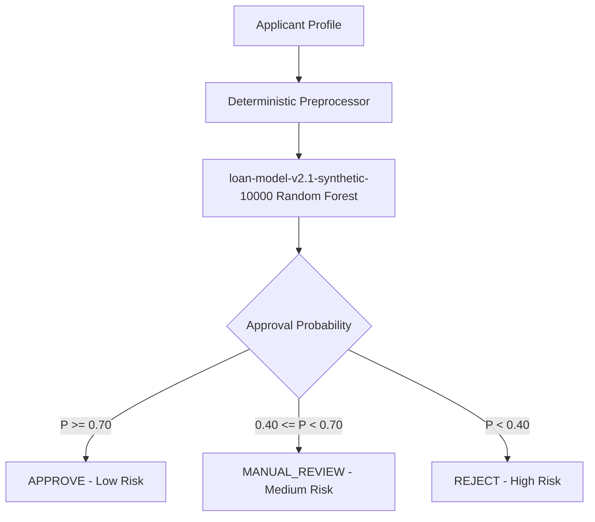

# CrediWiseAI — Model Explainability & Factor Attribution Report

> **Model Identifier:** `loan-model-v2.1-synthetic-10000` (Random Forest Classifier)  
> **Currency Base:** Indian Rupee (INR / ₹)  
> **Explainability Scope:** Global Feature Importances, Local Factor Attribution, and Stress Profile Analysis

---

## 1. Global Feature Importances

The champion Random Forest model distributes decision weight across the following primary features:

| Rank | Feature Name | Importance Weight | Cumulative Weight | Domain Interpretation |
| :--- | :--- | :--- | :--- | :--- |
| **1** | `cibil_score` | **78.25%** | 78.25% | Credit bureau repayment history & default risk |
| **2** | `estimated_payment_to_income_ratio` | **3.68%** | 81.93% | Monthly principal burden relative to monthly cash flow |
| **3** | `loan_to_monthly_income_ratio` | **2.16%** | 84.09% | Short-term debt-to-income multiple |
| **4** | `loan_term` | **2.07%** | 86.16% | Repayment tenure in years |
| **5** | `loan_to_annual_income_ratio` | **2.03%** | 88.19% | Overall borrowing leverage multiple |
| **6** | `asset_to_loan_ratio` | **1.93%** | 90.12% | Total asset collateral coverage ratio |
| **7** | `loan_term_months` | **1.75%** | 91.87% | Repayment tenure in months |
| **8** | `estimated_principal_monthly_payment` | **1.35%** | 93.22% | Monthly principal repayment requirement |
| **9** | `loan_amount` | **0.85%** | 94.07% | Requested principal amount |
| **10** | `commercial_assets_value` | **0.82%** | 94.89% | Commercial property collateral backing |
| **11-20** | Remaining Features | **5.11%** | 100.00% | Secondary financial variables & demographics |

---

## 2. Dominant Feature Analysis & Dataset Dynamics

### 2.1 The Role of CIBIL Score
- **Primary Driver:** `cibil_score` accounts for **78.25%** of the model's predictive weight.
- **Decision Threshold:** CIBIL scores $\ge 650$ establish high approval probabilities ($> 80\%$), while scores $< 550$ face significant default risk weighting and rejection probabilities.
- **Secondary Modifiers:** For applicants in borderline bands, the model heavily factors in `estimated_payment_to_income_ratio`, `loan_to_monthly_income_ratio`, and `asset_to_loan_ratio` to determine the outcome.

---

## 3. Local Factor Attribution Methodology

For real-time applicant feedback and administrative review, `backend/app/services/ml_service.py` extracts local decision factors based on applicant-specific thresholds:

### 3.1 Positive Decision Factors (Boosts Approval)
- **High Credit Score:** CIBIL score $\ge 750$ (Prime bracket).
- **Conservative Payment Ratio:** `estimated_payment_to_income_ratio` $\le 0.30$ (less than 30% of monthly income towards principal).
- **Healthy Leverage Multiple:** `loan_to_annual_income_ratio` $\le 2.5\times$.
- **Strong Collateral Backing:** `asset_to_loan_ratio` $\ge 2.0\times$ (assets exceed double the loan principal).
- **Strong Liquid Reserves:** `bank_asset_to_annual_income_ratio` $\ge 0.50$.

### 3.2 Negative Decision Factors (Increases Risk)
- **Sub-Prime / Critical Credit Score:** CIBIL score $< 600$ (or $< 550$).
- **Excessive Debt Burden:** `estimated_payment_to_income_ratio` $> 0.50$ (over 50% monthly income allocated to principal).
- **High Leverage:** `loan_to_annual_income_ratio` $> 3.5\times$.
- **Insufficient Collateral:** `asset_to_loan_ratio` $< 1.0\times$ (requested loan exceeds total asset base).

---

## 4. Realistic Indian Applicant Stress Test Results

Realistic Indian applicant profiles were evaluated through the production pipeline:

### Profile Test Matrix

| Profile Name | CIBIL | Monthly Income | Loan Principal | Tenure | Approval Prob | Recommendation | Risk Level | Key Factor Attribution |
| :--- | :--- | :--- | :--- | :--- | :--- | :--- | :--- | :--- |
| **1. Strong Indian Applicant** | **780** | ₹1,00,000 | ₹15,00,000 | 60 mo | **89.01%** | `APPROVE` | `LOW` | Excellent CIBIL (780), solid asset backing (₹63L total), conservative payment ratio |
| **2. Moderate Indian Applicant** | **700** | ₹60,000 | ₹8,00,000 | 60 mo | **89.83%** | `APPROVE` | `LOW` | Good CIBIL (700), conservative loan multiple (1.11x annual income) |
| **3. Borderline Applicant** | **650** | ₹50,000 | ₹10,00,000 | 48 mo | **82.36%** | `APPROVE` | `LOW` | Sufficient CIBIL (650), manageable payment-to-income ratio |
| **4. High Risk Applicant** | **560** | ₹35,000 | ₹12,00,000 | 36 mo | **62.90%** | `MANUAL_REVIEW` | `MEDIUM` | Moderate CIBIL (560), high debt burden requiring underwriter inspection |
| **5. Sub-550 CIBIL Applicant** | **450** | ₹40,000 | ₹10,00,000 | 36 mo | **35.18%** | `REJECT` | `HIGH` | Critical sub-550 CIBIL (450), elevated default probability |

---

## 5. Ethical Disclosures & Governance Limits

1. **Advisory Decision Support:** Model probabilities reflect statistical risk calculated on historical data augmented with synthetic applicant records. They do **not** constitute a formal bank guarantee or legal underwriting commitment.
2. **Fairness & Non-Discrimination:** Protected demographic attributes (gender, age, religion, marital status, caste) are completely excluded from the dataset and model pipeline.
3. **Transparent Explanations:** Every prediction is paired with plain-language positive and negative factors, ensuring applicants and loan officers understand the exact rationale behind every decision.
