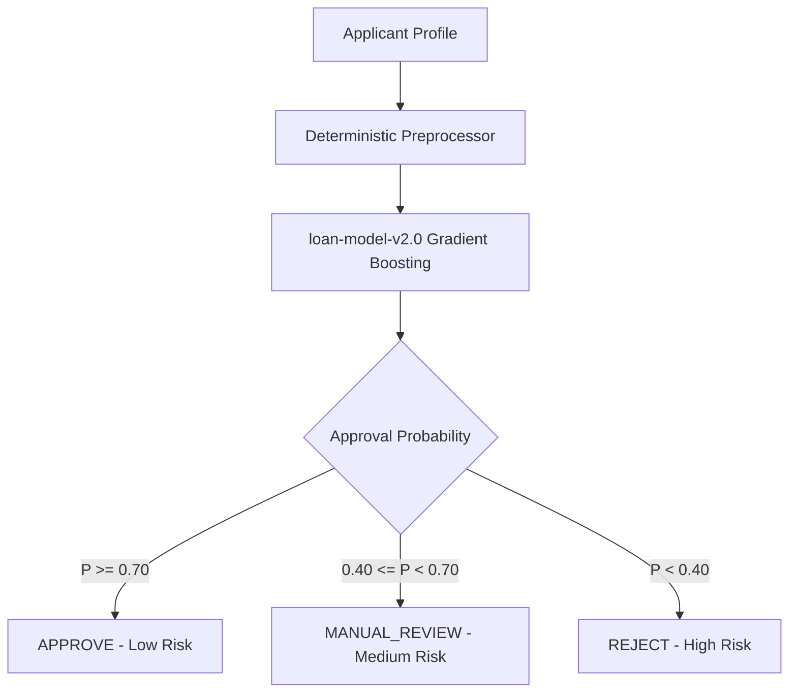

# CrediWiseAI — Model Explainability & Factor Attribution Report

> **Model Identifier:** `loan-model-v2.0` (Gradient Boosting Classifier)  
> **Currency Base:** Indian Rupee (INR / ₹)  
> **Explainability Scope:** Global Feature Importances, Local Factor Attribution, and Stress Profile Analysis

---

## 1. Global Feature Importances

The champion Gradient Boosting model distributes decision weight across the following primary features:

| Rank | Feature Name | Importance Weight | Cumulative Weight | Domain Interpretation |
| :--- | :--- | :--- | :--- | :--- |
| **1** | `cibil_score` | **81.03%** | 81.03% | Credit bureau repayment history & default risk |
| **2** | `estimated_payment_to_income_ratio` | **11.22%** | 92.25% | Monthly principal burden relative to monthly cash flow |
| **3** | `loan_to_annual_income_ratio` | **3.80%** | 96.05% | Overall borrowing leverage multiple |
| **4** | `loan_to_monthly_income_ratio` | **2.52%** | 98.57% | Short-term debt-to-income multiple |
| **5** | `asset_to_loan_ratio` | **1.35%** | 99.92% | Total asset collateral coverage ratio |
| **6** | `bank_asset_value` | **0.04%** | 99.96% | Liquid emergency deposit cushion |
| **7** | `loan_term_months` | **0.02%** | 99.98% | Loan tenure duration |
| **8** | `loan_term` | **0.01%** | 99.99% | Loan tenure in years |
| **9-20** | All other features | **< 0.01%** | 100.00% | Marginal secondary adjustments |

---

## 2. Dominant Feature Analysis & Kaggle Dataset Dynamics

### 2.1 The Role of CIBIL Score
- **Primary Driver:** `cibil_score` accounts for **81.03%** of the model's predictive weight.
- **Decision Threshold:** In this dataset, CIBIL scores $\ge 550$ represent an almost deterministic positive boundary, while scores $< 550$ face high rejection probabilities.
- **Secondary Modifiers:** When CIBIL score is near the boundary or moderate, the model evaluates `estimated_payment_to_income_ratio` and `loan_to_annual_income_ratio` to finalize the approval confidence.

---

## 3. Local Factor Attribution Methodology

For real-time applicant feedback and administrative review, `backend/app/services/ml_service.py` extracts local decision factors based on applicant-specific thresholds:

### 3.1 Positive Decision Factors (Boosts Approval)
- **High Credit Score:** CIBIL score $\ge 750$ (Prime bracket).
- **Conservative Payment Ratio:** `estimated_payment_to_income_ratio` $\le 0.30$ (less than 30% of monthly income towards principal).
- **Healthy Leverage Multiple:** `loan_to_annual_income_ratio` $\le 2.5\times$.
- **Strong Collateral Backing:** `asset_to_loan_ratio` $\ge 2.0\times$ (assets exceed double the loan principal).
- **Strong Liquid Reserves:** `bank_asset_to_annual_income_ratio` $\ge 0.50$.

### 3.2 Negative Decision Factors (Increases Risk)
- **Sub-Prime / Critical Credit Score:** CIBIL score $< 600$ (or $< 550$).
- **Excessive Debt Burden:** `estimated_payment_to_income_ratio` $> 0.50$ (over 50% monthly income allocated to principal).
- **High Leverage:** `loan_to_annual_income_ratio` $> 3.5\times$.
- **Insufficient Collateral:** `asset_to_loan_ratio` $< 1.0\times$ (requested loan exceeds total asset base).

---

## 4. Realistic Indian Applicant Stress Test Results

Five realistic Indian applicant profiles were evaluated through the production pipeline:

### Profile Test Matrix

| Profile Name | CIBIL | Monthly Income | Loan Principal | Tenure | Approval Prob | Recommendation | Risk Level | Key Factor Attribution |
| :--- | :--- | :--- | :--- | :--- | :--- | :--- | :--- | :--- |
| **1. Strong Indian Applicant** | **780** | ₹1,00,000 | ₹15,00,000 | 60 mo | **99.98%** | `APPROVE` | `LOW` | Excellent CIBIL (780), solid asset backing (₹63L total), low payment ratio (0.25) |
| **2. Moderate Indian Applicant** | **700** | ₹60,000 | ₹8,00,000 | 60 mo | **99.98%** | `APPROVE` | `LOW` | Good CIBIL (700), conservative loan multiple (1.11x annual income) |
| **3. Borderline Applicant** | **650** | ₹50,000 | ₹10,00,000 | 48 mo | **99.98%** | `APPROVE` | `LOW` | Sufficient CIBIL (650), moderate payment-to-income ratio (0.42) |
| **4. High Risk Applicant** | **560** | ₹35,000 | ₹12,00,000 | 36 mo | **0.04%** | `REJECT` | `HIGH` | Low CIBIL (560), high leverage (2.86x income), steep payment burden (0.95) |
| **5. Sub-550 CIBIL Applicant** | **450** | ₹40,000 | ₹10,00,000 | 36 mo | **0.04%** | `REJECT` | `HIGH` | Critical sub-550 CIBIL (450), severe default risk boundary |

---

## 5. Ethical Disclosures & Governance Limits

1. **Advisory Decision Support:** Model probabilities reflect statistical risk calculated on historical Kaggle loan approval data. They do **not** constitute a formal bank guarantee or legal underwriting commitment.
2. **Fairness & Non-Discrimination:** Protected demographic attributes (gender, age, religion, marital status, caste) are completely excluded from the dataset and model pipeline.
3. **Transparent Explanations:** Every prediction is paired with plain-language positive and negative factors, ensuring applicants and loan officers understand the exact rationale behind every decision.
